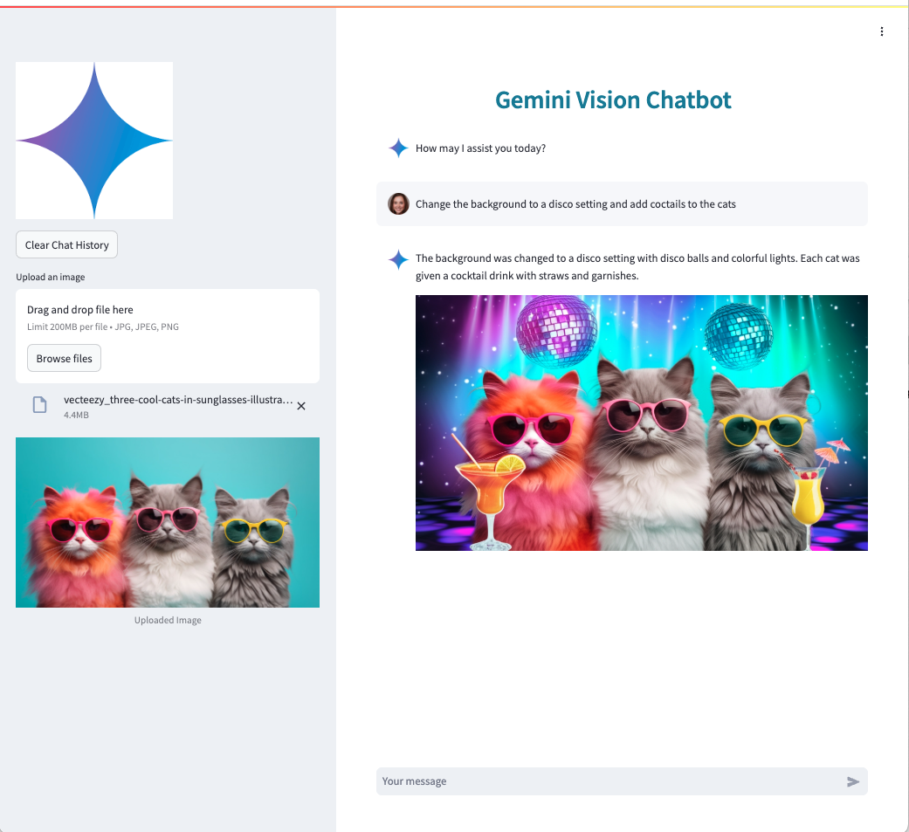

# Introduction  

Gemini Vision Chatbot demonstrate how to quickly build and deploy a chatbot powered with Gemini.  

This chatbot allows you to load an image and instruct `Gemini 2.0 Flash Experiemntal` (`Image Generation`) model to modify it.

The user interface is developed using Streamlit.  

The application is deployed with App Engine.




# Deployment using Google Cloud SDK


To init the Google Cloud SDK, run the command:

```~/google-cloud-sdk/bin/gcloud init```

See the list of projects with:

```~/google-cloud-sdk/bin/gcloud projects list```

Check what project is set:

```~/google-cloud-sdk/bin/gcloud config get-value project```


To set the current project, run:

```~/google-cloud-sdk/bin/gcloud config set project <PROJECT_NUMBER>```


To deploy  the application, run the command:

```~/google-cloud-sdk/bin/gcloud app deploy app.yaml --project <PROJECT_ID>```

# Start app

To start the application, run from the root:

```streamlit run --server.port 8080 --server.enableCORS false --server.enableXsrfProtection=false --server.enableWebsocketCompression=false app.py```

On local, if you want to test the app, just run:

```streamlit run app.py```